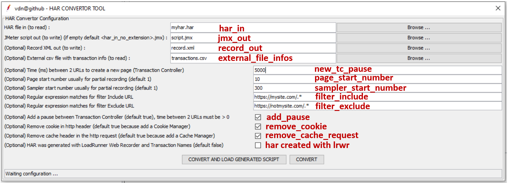

<p align="center">


  <p align="center">Convert a HAR file to a JMeter script and a Record XML file.</p>
  <p align="center"><a href="https://github.com/vdaburon/har-convertor-jmeter-plugin">Link to github project har-convertor-jmeter-plugin</a></p>
</p>

# Convert a HAR file to a JMeter script and a Record XML file.

## GUI interface in the JMeter Tools Menu
This tool is present in the Menu Tools > vdn@github - HAR Convertor Tool


When you click and the menu line "vdn@github - HAR Convertor Tool", the tool GUI is display



### Parameters
Parameters are :
* har_in the HAR file to read (exported HAR from Web Browser :  Chrome, Firefox, Edge ...)
* jmx_out the file JMeter script generated, if the text field is empty then the jmx_out is the file name of har_in without the extension with suffix ".jmx" <br/>
  e.g. har_in = myhar1.har, jmx_out is empty then file_out will be myhar1.jmx
* record_out create the record xml file from the har file (could be open with the Listener View Results Tree) <br/>
  e.g. record_out = record.xml
* new_tc_pause time between 2 urls to create a new page (Transaction Controller) (default 5000 = jmeter property value : proxy.pause=5000) <br/>
  * e.g. 5000 for 5 sec between 2 urls
* filter_include,  the regular expression matches the URL to Include <br/>
  * default all = empty (no filter)
  * e.g. filter_include = https://mysite.com/.*
* filter_exclude,  the regular expression matches the URL to Exclude <br/>
  * default all = empty (no filter)
  * e.g. filter_include = https://notmysite.com/.*
* add_pause checkbox, add Flow Control Action Pause, parameter new_tc_pause must be > 0 (default true) <br/>
* remove_cookie checkbox , remove header with cookie because add a Cookie Manager in the script (default true) <br/>
* remove_cache_request checkbox, remove cache request header because add a Cache Manager in the script (default true) <br/>

Status, the status line contains the tool status or the tool result.

e.g. : Status Results **OK**
* Tool HAR Convertor Finished OK, fileJmxOut=C:\Temp\script1.jmx
* Tool HAR Convertor Finished OK, fileJmxOut=C:\Temp\script1.jmx AND recordXmlOut=C:\Temp\record.xml

e.g. : Status Results **KO**
* Tool HAR Convertor Finished KO, CAN'T READ HAR fileHarIn = C:\Temp\harzzzz.har
* Tool HAR Convertor Finished KO, exception = java.util.regex.PatternSyntaxException: Unmatched closing ')' near index 2  (.))
* Tool HAR Convertor Finished KO, exception = net.sf.saxon.trans.XPathException: Failed to create output file file:/c:/toto.jmx


## Creating a har file and run the tool har-to-jmx-convertor to simulate recording from the JMeter recording template
This tool har-to-jmx-convertor try to **simulate** a script JMeter and a record xml file recording from the **JMeter Recording Template**.

### JMeter Recording Template and HTTP(S) Test Script Recorder  - The standard way to record
The JMeter Recording Template : <br/>


The result of recording with JMeter "HTTP(S) Test Script Recorder" : <br/>


### HAR created on a Browser (e.g. Firefox) - The new way with the convertor tool
Record the navigation in the web application with Developer tool : **Network** and **save** exchanges in **HAR** file format : <br/>


Launch the "Convertor tool" : <br/>


Tool results : Open the script created and the record.xml in a View Results Tree <br/>


## More documentation from har-to-jmeter-convertor
For more documentation look at README from [har-to-jmeter-convertor](https://github.com/vdaburon/har-to-jmeter-convertor)

## Command line tool (CLI)
This tool could be use with script shell Windows or Linux.

Scripts shell are in &lt;JMETER_HOME&gt;\bin
* har-convertor-to-jmeter.cmd for Windows OS
* har-convertor-to-jmeter.sh for Linux/Mac OS

Help to see all parameters :

<pre>
C:\apache-jmeter\bin&gt;har-convertor-to-jmeter.cmd -help
usage: io.github.vdaburon.jmeter.har.HarForJMeter [-add_pause &lt;add_pause&gt;] [-filter_exclude &lt;filter_exclude&gt;]
       [-filter_include &lt;filter_include&gt;] -har_in &lt;har_in&gt; [-help] -jmx_out &lt;jmx_out&gt; [-new_tc_pause &lt;new_tc_pause&gt;]
       [-record_out &lt;record_out&gt;] [-remove_cache_request &lt;remove_cache_request&gt;] [-remove_cookie &lt;remove_cookie&gt;]
io.github.vdaburon.jmeter.har.HarForJMeter
 -add_pause &lt;add_pause&gt;                         Optional boolean, add Flow Control Action Pause after Transaction
                                                Controller (default true)
 -filter_exclude &lt;filter_exclude&gt;               Optional, regular expression to exclude url
 -filter_include &lt;filter_include&gt;               Optional, regular expression to include url
 -har_in &lt;har_in&gt;                               Har file to read (e.g : my_file.har)
 -help                                          Help and show parameters
 -jmx_out &lt;jmx_out&gt;                             JMeter file created to write (e.g : script.jmx)
 -new_tc_pause &lt;new_tc_pause&gt;                   Optional, create new Transaction Controller after request ms, same as
                                                jmeter property : proxy.pause, need to be &gt; 0 if set. Usefully for Har
                                                created by Firefox or Single Page Application (Angular, ReactJS, VuesJS
                                                ...)
 -record_out &lt;record_out&gt;                       Optional, file xml contains exchanges likes recorded by JMeter
 -remove_cache_request &lt;remove_cache_request&gt;   Optional boolean, remove cache header in the http request (default true
                                                because add a Cache Manager)
 -remove_cookie &lt;remove_cookie&gt;                 Optional boolean, remove cookie in http header (default true because add
                                                a Cookie Manager)
E.g : java -jar har-for-jmeter-&lt;version&gt;-jar-with-dependencies.jar -har_in myhar.har -jmx_out scriptout.jmx
-new_tc_pause 5000 -add_pause true -filter_include "https://mysite/.*" -filter_exclude "https://notmysite/*"
</pre>


<pre>
C:\apache-jmeter\bin>har-convertor-to-jmeter.cmd -har_in "myhar.har" -jmx_out "script_out.jmx" -filter_include "https://mysite.com/.*" -filter_exclude "https://notmysite.com/.*" -add_pause true -new_tc_pause 5000
</pre>

<pre>
/var/opt/apache-jmeter/bin>./har-convertor-to-jmeter.sh -har_in "myhar.har" -jmx_out "script_out.jmx" -record_out "record.xml" -add_pause true -new_tc_pause 5000
</pre>

## Tool installed with jmeter-plugins-manager
This tool could be installed with the jmeter-plugins-manager from jmeter.plugins.org.<br>
The tool name is : "vdn@github - har-convertor-jmeter-tool"

## Usage Maven
The maven groupId, artifactId and version, this plugin is in the **Maven Central Repository** [](https://maven-badges.herokuapp.com/maven-central/io.github.vdaburon/har-convertor-jmeter-plugin)

```xml
<groupId>io.github.vdaburon</groupId>
<artifactId>har-convertor-jmeter-plugin</artifactId>
<version>1.0</version>
```
## Versions
Version 1.0 date 2024-0311, First Release

